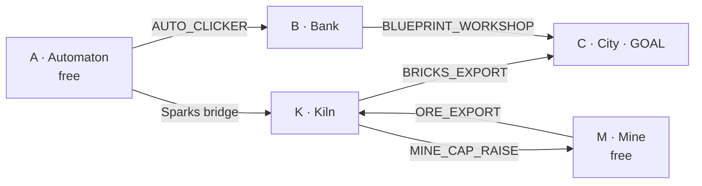

# Alphabet Idlers — Prototype Design Doc

**Status:** prototype spec · **Scope:** 5 of an eventual 26 games · **Goal:** test one hypothesis cheaply.

## 1. The hypothesis we're testing

The full concept is 26 mini incremental games (one per letter), each self-contained and
designed to *saturate* (run out of meaningful progress) in under ~30 minutes for a given setup.
Hitting a threshold in one game unlocks something — automation, a cap raise, a new building, a
currency bridge — that matters in *another* game. Everything runs in parallel.

The bet is that **the fun is not in any individual idler. It's in the routing puzzle**: figuring
out what order to break through the games in, given a dependency web with multiple valid paths.
Think "metroidvania of idlers" or a critical-path puzzle wearing idle-game clothes.

This prototype exists to answer one question and nothing else:

> **Is routing across a small web of saturating idlers actually fun, or does it just feel like
> chores with arrows?**

If 5 games can't make the routing interesting, 26 won't either. If they can, we scale.

## 2. Scope

**In:**
- 5 games forming a real dependency DAG (not a chain, not a tree — it has a diamond).
- 2 free entry points, automation rewards, a cap-raise reward, currency bridges, one terminal goal.
- Parallel real-time ticking, manual + automated play, a single win condition.
- Minimal save (localStorage), minimal UI (one screen, 5 panels).

**Explicitly out (prototype non-goals):**
- The other 21 games. Art, sound, theme/narrative polish. Prestige/meta-progression.
- Mobile layout, offline-progress accrual, balancing for "fun curves" beyond rough saturation.
- Randomized/seeded graphs (that's the *next* experiment if this one works — see §11).

## 3. The five games

Each game is tiny: one panel, one or two numbers, one or two buttons. Depth comes from the web,
not from any single game. "Manual baseline" = how it plays before any rewards arrive. "Emits" =
what crossing its threshold unlocks elsewhere.

### A — Automaton (entry point, free)
- **Mechanic:** pure clicker. Button → `Sparks`. Upgrades increase Sparks/click.
- **Manual baseline:** click to earn, buy click-power upgrades. Tedious by ~2 min (the point).
- **Threshold:** 1,000 Sparks.
- **Emits:**
  - `AUTO_CLICKER` (automation). Usable in A itself (lets it saturate higher hands-free) **and**
    the de-facto prerequisite for B being bearable.
- **Saturates when:** click-power upgrades cap (~5 min with auto-clicker running).

### M — Mine (entry point, free)
- **Mechanic:** depth idler. Dig action advances `Depth`; each depth tier yields `Ore` at a rate.
  Deeper = more Ore/sec but higher dig cost.
- **Manual baseline:** click to dig, spend Ore to buy dig-speed. Stalls at a hard depth cap.
- **Threshold:** Depth 10 (hits the cap).
- **Emits:**
  - `DRILL` (automation): auto-dig.
  - `ORE_EXPORT` (bridge): Ore becomes a usable input in K.
- **Saturates when:** Depth cap reached — and stays capped *until K raises it* (see K). This is the
  intentional soft-lock that forces interleaving.

### B — Bank (needs A in practice)
- **Mechanic:** compounding interest. Deposit `Sparks`, earn `Gold` at rate `r` per tick on balance.
- **Manual baseline:** without `AUTO_CLICKER`, you must hand-feed Sparks from A — miserable, so B
  is *soft-gated* behind A's automation. (We don't hard-lock it; we let the player discover that
  manual feeding is awful. Tests whether soft-gating reads clearly.)
- **Threshold:** 10,000 Gold.
- **Emits:**
  - `BLUEPRINT_WORKSHOP` (new mechanic): unlocks the high-value building in C.
  - `RATE_BOOST` (curve-bender): improves B's own `r` (lets B's own number keep climbing a while).
- **Saturates when:** balance growth outpaces what Sparks income can feed → flatlines (~8 min).

### K — Kiln (needs M's ore + A's sparks)
- **Mechanic:** production chain. Consumes `Ore` + `Sparks` → produces `Bricks`.
- **Gated behind:** `ORE_EXPORT` from M (no ore = no kiln).
- **Threshold:** 200 Bricks.
- **Emits:**
  - `BRICKS_EXPORT` (bridge): Bricks become C's construction material.
  - `MINE_CAP_RAISE` (cap raise): lifts M's Depth cap from 10 → 25, **reviving the saturated Mine.**
    This is the keystone that makes the order matter: M alone saturates and *needs K to continue*,
    but K needs M to start.
- **Saturates when:** input rate (Ore+Sparks) caps out its throughput.

### C — City (terminal goal)
- **Mechanic:** spatial grid (say 6×6). Place buildings, adjacency bonuses, generate `Population`.
- **Gated behind:** needs `BRICKS_EXPORT` (from K) to build past tier-1 houses, and
  `BLUEPRINT_WORKSHOP` (from B) to place the high-value Workshop building.
- **Win condition:** **Population ≥ 1,000 = prototype "solved."**
- **Emits:** nothing (it's the sink). In the full game C would feed back into others; here it's the goal.

## 4. The dependency graph

The whole point. Note it is *not* linear: C requires two independent upstream chains to converge
(a diamond), and M↔K is a deliberate mutual dependency broken by sequencing.



**Why this is a puzzle and not a checklist:**
- Two free entry points (A, M) → the player chooses where to invest attention first.
- **The diamond:** C needs *both* the Bank chain (A→B→Blueprint) and the production chain
  (A+M→K→Bricks). You can't tunnel one path; you must interleave.
- **The broken cycle (M↔K):** M saturates at Depth 10 and is *stuck* until K grants
  `MINE_CAP_RAISE` — but K can't run until M has shipped enough Ore via `ORE_EXPORT`. So the
  correct play is "push M to its cap, pivot to K, then come back to M," which is exactly the
  interleaving-under-saturation behavior we want to validate.
- **Soft-gate (A→B):** B is technically playable from t=0 but punishing without `AUTO_CLICKER`,
  teaching the player to value automation rewards.

There is no single forced order — e.g. you can open on A or M, and you can bank `RATE_BOOST`
progress in parallel — but every route has to respect the diamond and the broken cycle. That
tension is the thing we're measuring.

## 5. Reward taxonomy (reference)

Rewards must change a game's *shape*, never just "+10%". Every emit above maps to one of:

| Type | Example here |
|---|---|
| **Gate** — unlocks a game at all | `ORE_EXPORT` enables K |
| **Automation** — removes manual clicking | `AUTO_CLICKER`, `DRILL` |
| **Cap raise** — pushes a saturated game further | `MINE_CAP_RAISE` |
| **Curve-bender** — changes a growth/cost exponent | `RATE_BOOST` |
| **New mechanic** — qualitatively new building/action | `BLUEPRINT_WORKSHOP` |
| **Bridge** — one game's currency feeds another | `ORE_EXPORT`, `BRICKS_EXPORT`, Sparks→K |

If a future game's reward is just a flat multiplier, it's a design smell — rework it into one of these.

## 6. Expected session

- **Length:** ~15–25 min for a first solve; faster once the route is known.
- **Shape:** open on A and/or M → unlock automations → both run hands-free → pivot to the chains →
  resolve the M↔K cycle → converge both chains on C → hit Population 1,000.
- **Failure mode we're watching for:** player gets a clear linear sequence handed to them and just
  waits out timers. If that happens, the graph isn't tangled enough (or saturation is too slow).

## 7. Core systems / data model

Keep it dead simple. One tick loop, a uniform game interface, a global event bus for unlocks.

```
GameState {
  resources: { sparks, gold, ore, bricks, population, ... }   // plain numbers
  unlocks: Set<FlagId>                                          // e.g. "AUTO_CLICKER"
  games: { A, M, B, K, C }                                      // per-game local state
  startedAt, lastTick
}

interface Game {
  id
  tick(dt, state)            // advance this game; read/write resources; auto-emit on threshold
  render(el, state)          // draw its panel
  onClick(action, state)     // manual actions (dig, click, deposit, place-building)
  thresholdMet(state) -> bool
  emits: [{ flag, when: thresholdMet }]
}
```

- **Loop:** `requestAnimationFrame` → compute `dt` → `tick` each game → check thresholds → fire
  any newly-met emits onto the bus → re-render dirty panels. Target 5–10 Hz logic tick is plenty.
- **Unlocks:** when a threshold is first met, set the flag in `state.unlocks` and let consuming
  games read it in their own `tick`/`render`. No hard coupling between game modules beyond shared
  resources + the flag set.
- **Save:** serialize `GameState` to `localStorage` every few seconds + on unlock; load on boot.
  No offline accrual in the prototype (clamp `dt` so a backgrounded tab doesn't fast-forward).
- **Win check:** global watcher on `population >= 1000` → show a "Solved in MM:SS" banner.

## 8. UI sketch

Single screen. Five panels in a grid, plus a thin top bar.

```
┌───────────────────────────────────────────────┐
│  ⏱ 04:12   Sparks 1.2k  Gold 8k  Ore 340  …    │  ← top bar: timer + resource readout
├───────────────┬───────────────┬───────────────┤
│ A · Automaton │ M · Mine      │ B · Bank       │
│ [click]  ⚙auto │ [dig]  depth7 │ deposit ▮▮▮     │
├───────────────┼───────────────┼───────────────┤
│ K · Kiln      │ C · City  🎯  │  (unlock log)   │
│ ore→bricks    │  [6×6 grid]   │  ✓ AUTO_CLICKER │
└───────────────┴───────────────┴───────────────┘
```

- Locked games render greyed with a "needs: ORE_EXPORT" hint so the graph is legible in-game.
- An **unlock log** (bottom-right) lists rewards as they fire — this is the player's map of the web.
- Saturated games show a "✓ maxed" state so the player knows to look elsewhere (drives routing).

## 9. Tech choice

Single static `index.html` + vanilla JS (or one small file per game under `games/`), no build step,
no framework. Rationale: a prototype whose only job is to answer a fun question should be cheap to
write, trivial to run (open the file), and easy to throw away. `requestAnimationFrame` + Canvas for
the City grid, plain DOM for everything else. Add a framework only if the prototype graduates.

## 10. Build order (milestones)

1. **M0 — Skeleton:** tick loop, GameState, top bar, one game (A) clicking up Sparks. Save/load.
2. **M1 — Automation:** A's threshold fires `AUTO_CLICKER`; A runs hands-free. Proves the emit bus.
3. **M2 — Second entry + bridge:** add M; wire `ORE_EXPORT`; add K consuming Ore+Sparks → Bricks.
4. **M3 — The broken cycle:** M caps at Depth 10; K's `MINE_CAP_RAISE` revives it. (Core puzzle beat.)
5. **M4 — The diamond:** add B (soft-gated behind A) and C; wire `BLUEPRINT_WORKSHOP` + `BRICKS_EXPORT`;
   add win condition. Now the full graph is playable end to end.
6. **M5 — Legibility pass:** locked-state hints, unlock log, "maxed" markers, run timer/solve banner.

Stop after M5. Do not add games. Playtest and answer §1.

## 11. What success looks like (and what's next)

**Success = a playtester, given no instructions, experiences a real "ah, I should pivot to K now"
moment** rather than waiting out a single obvious sequence. We're measuring *decision density*, not
polish. Cheap signal: ask 3–5 people to solve it and narrate; if they all describe the same forced
order, the web is too linear.

If it works, the immediate next experiments (not this doc):
- **Seeded/randomized graphs** → turns the one-shot into a replayable speed-routing roguelike.
- **Solve-time scoring / leaderboards.**
- **Scale toward 26** by designing the *graph first*, then fitting mechanics to nodes.

## 12. Open questions / risks

- **Saturation tuning is the whole ballgame.** Too slow → idle-waiting, not routing. Too fast →
  no parallelism, just a sequence. Expect most iteration here.
- **Does soft-gating read?** Will players understand B is "available but bad" without `AUTO_CLICKER`,
  or will it feel like a bug? May need an explicit hint.
- **Attention budget:** even 5 parallel games may feel busy. If so, 26 is a real UX problem worth
  knowing about now.
- **Is the City grid worth it?** It's the most expensive game to build. If M3 already shows the
  routing is fun, consider stubbing C as a simple meter for the prototype and saving the grid for later.
